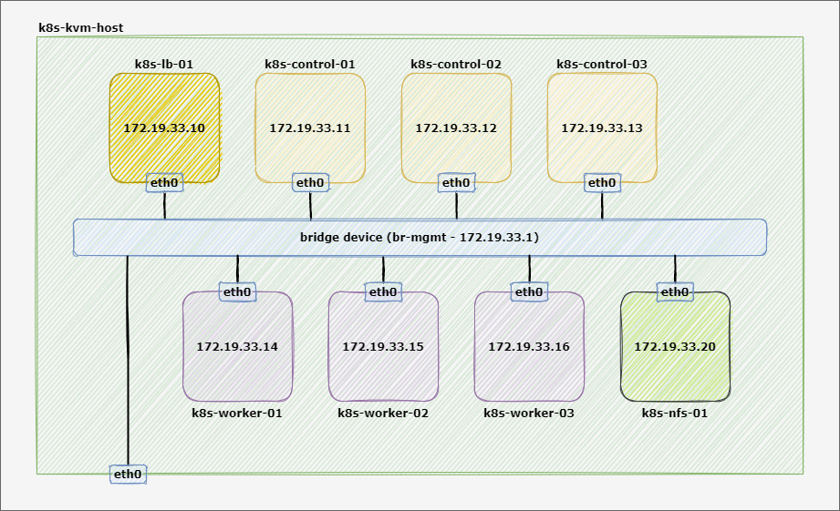

# Kubernetes The Hard Way - KVM Edition
This tutorial walks you through setting up Kubernetes the hard way on top of KVM hypervisor. This guide is not for people looking for a fully automated command to bring up a Kubernetes cluster. If that's you then check out [Google Kubernetes Engine](https://cloud.google.com/kubernetes-engine), or the [Getting Started Guides](https://kubernetes.io/docs/setup).

This tuturial is based on the original "[Kubernetes The Hard Way](https://github.com/kelseyhightower/kubernetes-the-hard-way)" created by Kelsey Hightower which provide the steps for bootstrapping a Kubernetes cluster on top of GCP (Google Cloud Platform).

In this version, I provide the steps for bootstrapping a Kubernetes cluster as an On-Prem solution (on top of a KVM hypervisor), and I also have extended the original tutorial with some additional labs which provide more capabilities to the whole cluster, below is a summary of the changes/additions:
* The cluster is deployed on top of a KVM hypervisor
* Docker Community Edition (CE) is used as the Container Runtime (Instead of containerd)
* The Kubernetes worker components are deployed both on the controller and worker nodes
* Bootstrapping the worker nodes is done using TLS bootstrapping 
* HAProxy is used as a frontend load balancer for the Kubernetes API
* Weave Net used as the CNI Plugin
* Additional lab for deploying Metrics Server Add-on (to provide metrics for pods and nodes)
* Additional lab for deploying MetalLB (to implement the LoadBalancer Service type)
* Additional lab for deploying Ingress Controller
* Additional lab for bootstrapping an NFS server and deploying NFS CSI Driver
* My personal touch :smile:

Kubernetes The Hard Way - KVM Edition is optimized for learning, which means taking the long route to ensure you understand each task required to bootstrap a Kubernetes cluster.

> The results of this tutorial should not be viewed as production ready, and may receive limited support from the community, but don't let that stop you from learning!

## Target Audience
The target audience for this tutorial is someone planning to support an On-Prem production Kubernetes cluster and wants to understand how everything fits together, once you complete all the labs you'll have a fully working Kubernetes playground for learning and testing purposes.

## Topology Diagram

## Cluster Components Details
Kubernetes The Hard Way guides you through bootstrapping a highly available Kubernetes cluster with end-to-end encryption between components and RBAC authentication.
* [Red Hat Enterprise Linux](https://www.redhat.com/en/technologies/linux-platforms/enterprise-linux) v8.5
* [kubernetes](https://github.com/kubernetes/kubernetes) v1.23.3
* [Docker Community Edition (CE)](https://docs.docker.com/engine/) v20.10.12
* [etcd](https://github.com/etcd-io/etcd) v3.5.2
* [HAProxy](https://github.com/haproxy/haproxy) v1.8.27
* [Weave Net CNI Plugin](https://github.com/weaveworks/weave) v2.8.1
* [CoreDNS](https://github.com/coredns/coredns) v1.8.7
* [Kubernetes Metrics Server](https://github.com/kubernetes-sigs/metrics-server) v0.6.1
* [MetalLB](https://github.com/metallb/metallb) v0.11.0
* [NGINX Ingress Controller](https://github.com/kubernetes/ingress-nginx/) v1.1.1
* [NFS CSI driver](https://github.com/kubernetes-csi/csi-driver-nfs) v3.1.0

## Labs
1. [Prerequisites and KVM host preparations](docs/01-prerequisites.md)
2. [Topology Overview and Provisioning the Compute Resources](docs/02-topology-and-compute-resources.md)
3. [Installing Container runtime](docs/03-container-runtime.md)
4. [Installing the kubectl Client Tool](docs/04-client-tools.md)
5. [Provisioning a CA and Generating TLS Certificates](docs/05-pki-Infrastructure.md)
6. [Generating Kubernetes Configuration Files for Authentication](docs/06-kubernetes-configuration-files.md)
7. [Generating the Data Encryption Config and Key](docs/07-data-encryption-keys.md)
8. [Bootstrapping the etcd Cluster](docs/08-bootstrapping-etcd.md)
9. [Bootstrapping the Kubernetes Control Plane](docs/09-bootstrapping-kubernetes-controllers.md)
10. [Configuring the Kubernetes Control Plane](docs/10-configuring-kubernetes-controllers.md)
11. [Bootstrapping the Kubernetes API Load Balancer](docs/11-bootstrapping-kubernetes-lb.md)
12. [Bootstrapping the Kubernetes Worker Nodes](docs/12-bootstrapping-kubernetes-workers.md)
13. [Configuring kubectl for Remote Access](docs/13-configuring-kubectl.md)
14. [Deploying the CNI Plugin](docs/14-cni-plugin.md)
15. [Deploying the DNS Cluster Add-on](docs/15-dns-addon.md)
16. [Deploying the Metrics Server Add-on](docs/16-metrics-server-addon.md)
17. [Deploying the LoadBalancer Service Add-on](docs/17-loadbalancer-service-addon.md)
18. [Deploying the Ingress Controller](docs/18-ingress-controller.md)
19. [Bootstrapping the NFS Server](docs/19-bootstrapping-nfs-server.md)
20. [Deploying the NFS CSI Driver](docs/20-nfs-csi-driver.md)
21. [Smoke Test](docs/21-smoke-test.md)
22. [Cleaning Up](docs/22-cleanup.md)
